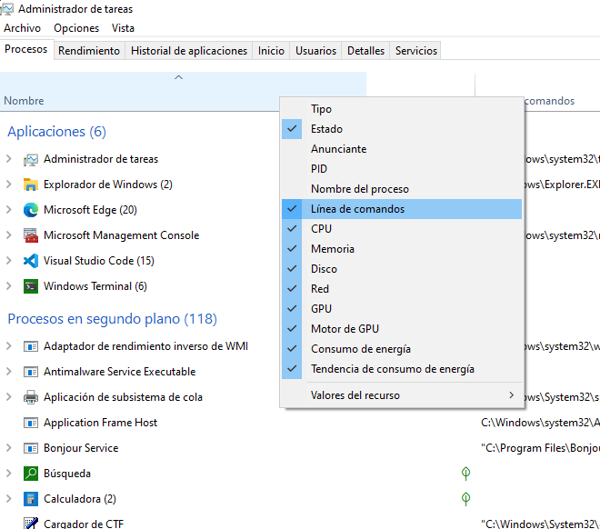
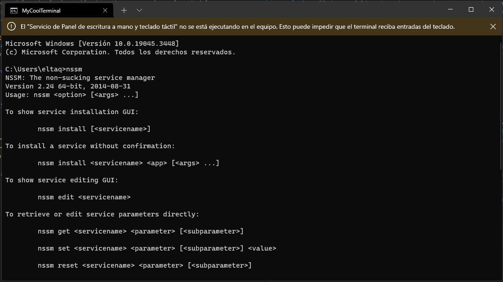
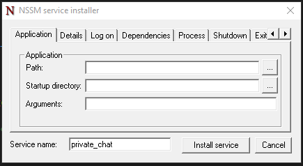
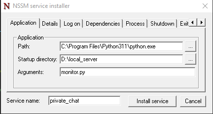
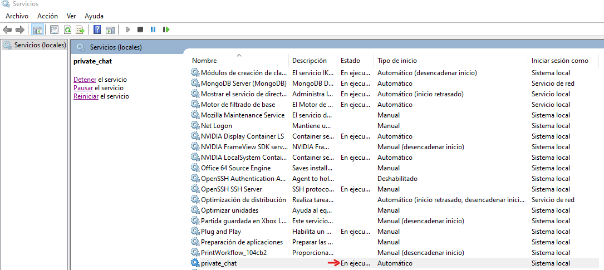
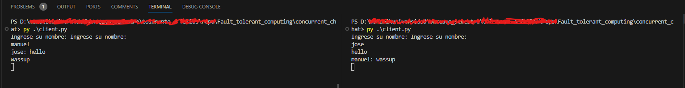

# Monitoring our apps

## Monitoring our local chat room
We take the previous assessment code (branch assessment_7) for the concurrent chat to use as target of monitoring.

## How to use our local server?
In this case we don't need any other library or something external

You only need to open the terminal and run the following command to run the server:
```
cd concurrent_chat && py server.py
```

Once the server is running and there isn't any error or issue
run the command on other terminal (up to 5):
```
cd concurrent_chat && py client.py
```
that all, out have your own private chat (imagine this in a private network)

## How to solve the issues about the server crashing and re started manually
Bc we are a silly programmaer, our bad server, can crash or stop to runnig
But we need to keep it running and go the folder and run the command again
Gat a pain in the ass. As good programmers that we are, we are gona create a script to solve that and spend the double of time that will actually will cost us to re-run the scrip every time the script fails

### HUGE DISCLAIMER (PLS YOU HAVE TO READ IT)
First of all, you need to have installed python a shared folder that the system can acces to it, so if youre runnig this on windows, probably you will need to unistall python an restall it as custom mode, and then, check the opcion of (install for all the users) that will make the executable and the most important, the libraries isntalled on a folder that the system has access or knows where is it. 
(All of this bc I did not speend the time to learn how to use the dependencies tab of NSSM, you will see what is that in the next steps)

### First things first: Our monitor
We neeed to create a script that where able to check if our process is running on the system, how to achive that, easy my boy, we just need to install a library haha
run the command:
```
pip install psutil
```
this one should not be installed on user flag!!.

Once we have the library, we are good to goo, the script is pretty simple, we just need to check in the process running if our script is there, if not , run the the command to execute it. I don't tink is needed to explain the code at all in this part, the main loop just to check every minute if the command is runnig if not run it

#### The server command
As you probably see, its a weird string with 2 comannds in it, and yes, that is the actuall command string of the process runing on the system, how I know this: Simple, run the task manager and right click on a header and mark the opcion, command line 


Ta da!, you have the commands of all the scripts running on your computer

### Part two: Download NSSM
As the title says, install the Non-Sucking Service Manager, and add it to our path it makes the live more easy, just like me, se how easy is it: 


### Act three: Get our hands dirty
This is the nasty part of all beginner creating code my buddy, you will need to get your hand dirty and do stuff
- First you will need to move the server.py and monitor.py into a new folder wherever your want (make the good decision to move it close to the root on your disk), bc you will need the full path to both of them
- Once you did that and all the changes on the path on the monitor script are made it (yes if you move it to different folder, the path changes my buddy :n )
- Now the real work is comming

### Four (yes just four): Create the service
If your had done all good at this point, the only part missing is install it, let go to that:
Step 1: Check were is python on your machine as simple that running
```
where python
``` 
on the command line

step 2: Had at hand the path of the new folder created
step 3: Lest install that b*#~$, run the command:
```
nssm install private_chat
```
Probably will ask your to give it access, click yes and this window will pop up



step 4: We need to fill the field, we need to add the absolute path for python and for our script location, this is my case:


And hit install button
Step 5: See the service, go to the service app, and look for it, and then start it up, to see if is working or nothing bad happend



If all go well, you will see the service on execution, and just had to test it out

Step 6: Run the client to send messages:


### That's all
If you follow the steps you now have your own script that executes at start up, for have all your private chat stuff blaming about your manager or the company whiout concerns (it's joke, unless that you where the VP or something, what I doubt)
