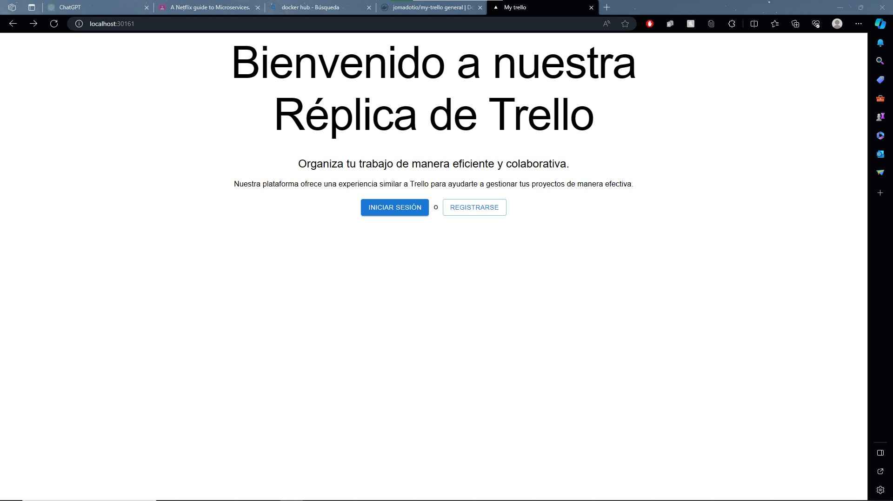
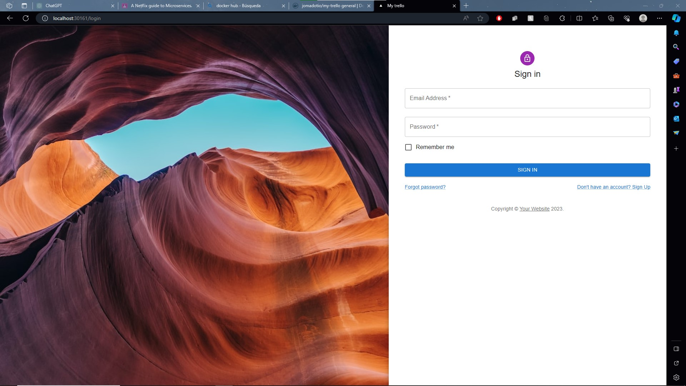
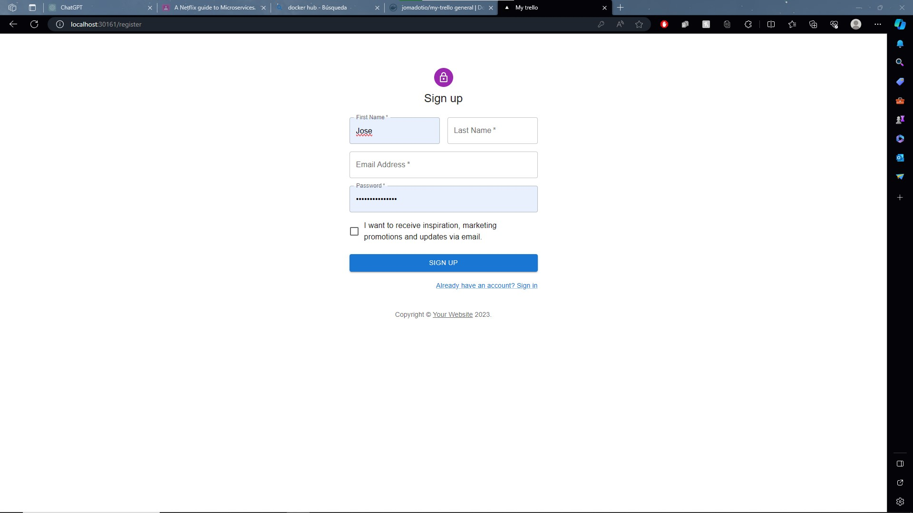

# Kubernetes

## What is Kubernetes?
Kubernetes is a platform/service planed to create automated tasks, scalate and make aplications works in containers, whichones are more ligth and portables that having a whole productions enviroment (server, cluster, networking, etc.) that help us to administrate the life cicle of our app and failure tolerance

The 3 main concepts are the Pod, services, and deployments:
 - Pod: We can see it like a container on docker, literally it works like that but with different name
 - Services: The pods by itself will no have a way to comunicate with the external world, the services, help us to achive that, exist multiple types of services, that are created to achive certain behaviour.
 - Its the main soruce of creation for the pods and Services (this doesn't mean that you cannot create a pod/service without a deployment) it help us, to have organiced the resoruces that we need, that way we can easly deploy our app
## What is an Ingress?
It's a resource that administrate the external access to services inside a cluster. Allowing us to configurate the rules of routing. It gives us a a way to expose the services in a controlled and flexible way.
## What is a LoadBalancer?
It's a resource that distribute the trafic on the network on a balanced way beteween all the pods to ensure the aviability and scalability of all the resources, it help us also to expose the services to the world.

### Our App
It's time to create now our client side for our app, bc we need a fancy way to use our microservices and be ussefull for something. Bc we are doing a clone of the trello app, I decide to create it using react with Next.js.

So for first instance, we are creating the MOCK of landing page, the login, and register, just to ensure the functionality of the app, and see if the deploy works as main pourpuse of the practice.

#### The client app
##### The bad landing page
Yes I know it sucks, but i'm not that good, on desing of the beautty of the web page, for that reason, bc it's a mock, I will keep it simple.

Tada haha, I will upgrade it on heach iteration, bc also we are missing the 80% of the funciontality (the boards, lists, and cards)

##### The login page.
It is a simple login page, nothing from other world.


##### The register page.
The same as the login, just simple register.


#### The interesting stuff the deployment
##### The docker stuff
The first thing we need to do is the image on docker, for that reason, we create the dockfile, with the instrucctions of how we need to create the app, and run it
```Docker
FROM node:20

WORKDIR /app

COPY package.json ./
COPY tsconfig.json ./

RUN npm i

COPY next.config.js ./next.config.js
COPY src ./src
COPY public ./public
COPY next-env.d.ts ./next-env.d.ts

RUN npm run build

CMD ["npm", "run", "start"]
```

Once we have it ready, we build the image, to ensure that it works, and nothing failed, we can now, crete a container to ensure that it works as expected, I did it, using a docker-compose:
```yaml
version: '3'
services:
  client-app:
    image: my-trello-app:v1
    build: .
    ports:
      - 3003:3003
```
Simple, we just create the service, the image, from where it has to build, and the ports needed to expose the app.
Once we have it running and see the home page, ready to Kubernetes.

##### The cubernetes stuff
Now we have to push our image to the docker hub, to ensure that it can be build it, if the image isn't found on the local docker.
And we create the deployment file with the service:
```yaml
apiVersion: apps/v1
kind: Deployment
metadata:
  name: client-deployment
  labels: 
    app: clientApp
spec:
  replicas: 1
  selector:
    matchLabels:
      app: clientApp
  template:
    metadata:
      labels:
        app: clientApp
    spec:
      containers:
      - name: client-trello
        image: jomadotio/my-trello:v1
        ports:
        - containerPort: 3003
---
apiVersion: v1
kind: Service
metadata:
  name: client-service
spec:
  selector:
    app: clientApp
  ports:
  - protocol: TCP
    port: 3003
    targetPort: 3003
  type: NodePort
```

Were we define the pod crated and also the service, in this case, bc it's just a web page, I create the service as type NodePort, that it will open a port for it (yes, for a some reason it decide a random port not like the loadbalancer type, that respect the port that you give it haha)

And that all folks!!
