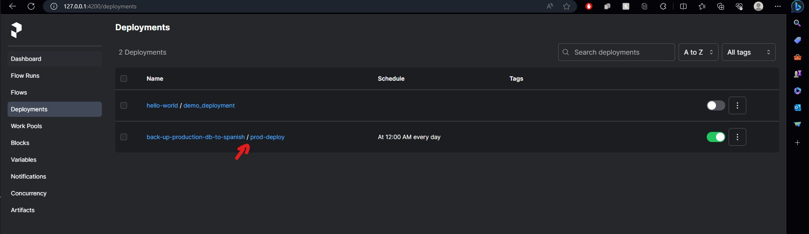

# Introducction to Prefect
In this assessment we learn alittle bit about the library Prefect

## What is Prefect? (just for academic puorpose)
That is a good question? On my understanding, is a tool that works as an orquestrator for task, why we use something like this? I saw that it's common for the area of data analitics. So, what we mean as an orquetrator? You can look it as a Pipeline with steroid: Bc it allows so much stuff. 

On my perpective, it kinda work for programatically do automatization of task, bc you can do schedules, have control if the code fails (do stuff, retrys, etc), have workflows if certains conditions happend, and so on.

## How to run the code? (DO NOT SKIP THIS)
As in metioned on the Prefect Documentation [Prefect Doc](https://docs.prefect.io/2.13.4/), on the installation steps, you can do it locally or using the cloud that they provide, so, in my case, I used my local. Just follow the steps on the repo and that it, you will have to read it, bc this library if you don't have the perfect configuration, will not work at first time

To run it, just type the command:
```
prefect server start
```
And that it, will display the information and the url with the port for see the web page on your local (Yeah I wasn't expecting that)


### Run the code
Once that the server is running as simple, that only execute the code as usual, prefect by itself will connect to the server and you will able to see the flows, as the image bellow (The first URL to the tutorial, explain the page, don't worry about it)


#### Note
For the  `main.py`, probably you will get an error, bc I configured a block whit a string just to see how it works, that is pretty cool, just follow the first tutorial up to the blocks sections and you will get it.

## Folders

### Tutorial Folder
In this folder are 2 script, the first one called `main.py` was form this tutorial to learn the new updated on the API for the Library (Mainly bc the resource for the assessment was 3 years old), here is the Link to the video [Prefect 2023](https://www.youtube.com/watch?v=D5DhwVNHWeU&ab_channel=KahanDataSolutions)

The file `main2.py` was from video tutorial for the assessment, but basically you can look into the dock and it's more quick and has the API updated to work on what we need.

### Example Folder
For an example, I deceides to create a small flow (also bc I can't imagine already an implementation on an big peace of code), to simulate a something like a webjob for C# (An automated task) from my work. The main escenario is kinda we are making a `back up` for the data, from one place to other, and this will be executed each day at 12 PM.

Concept ussed: 
- Tasks
- Flows
- Schedules
- Cache
- Retries
- Task runners
- agents

#### Ways to run it
##### First way, just run the code
The first way is runnig the code as it's, this will execute and you will be able to saw the flow and the graphs
##### Second way, creating a deployment
The second one, is creating a deploy, so for that, you will need to follow this steps (I do using the code way):
- First, you will need to uncomment the line 97, and comment line 98
- Then run the script
- That it, all done, this will create a deplyment whit the schedule


## Final Thoughts
It looks good, but it's hard to figure it out how to use it on a more on a straight foward code with interactions with the user, but seems usefull for run automated task, coudl help in the future.
