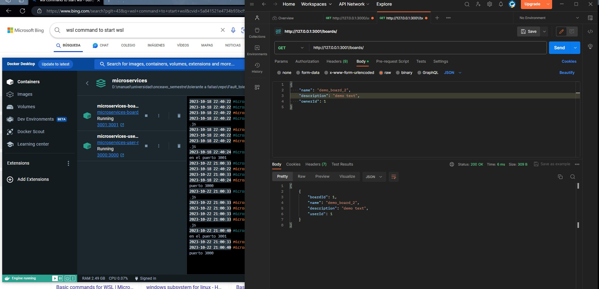

# Introduction to Docker
At this point we need to learn how to make our app run in a different enviroment for multiple purposes
So the first thing that we are going to do is our first app ussing Docker

## Our App
We just created a simple microservices app so simulate what does Trello, of course with the plan to modified for my collage and adding fancy stuff
For this reason we created the microservices ussing JS/TS with express and SQLite3 for have a small version of a DB.

The microservices abalibles currently are the User & Board API's, the simple CRUD for those is working as intended for this assessment

### How to run the app
As we mention at be a assessment related to Docker, I already packed all to run on docker with a simple command:
```
docker compose up (run de command at same level where the docker-compose is located, in this case ./microservices)
```
This will create the images for both apps, do all the needs for each app and execute it in a container with both images running inside the container
And as simple like that running that command we ensure that our app will run on a container without need of an specific software installed on our machine
Once the images are already builded, the output will show like this:


### How this work
I will skip the explanation of how the code works becauses isn't needed a explanation in general for a simple CRUD doing operations directly to a DB, with that being said, I'll focus to the core functionallity of the assessment - DOCKER

To been able to create a container, is needed to create a image of what we want to run in the container, for that purpose, exist the Dockerfile. 
On the docker file we can specify the needs of the app for build itself.

#### Ours Dockerfiles
On each of the microservices created on the microservices folder, you can find a "Dockerfile" in it, if you open it, will the the intrucctions needed for the app to build.
In that case we are specifying the "image" needed (could be a whole ISO, small version of one, a specific version of certain app, etc.) in this case we define that needs Node.js on the version 20.
Then a bunch of commands to copy the source code to the image that is going to build.
Then we declare the command wannted to execute once the files are copied
tell it to expose the number of port inside the image, and at the end it's the command to run on execution time.

#### The Docker compose magic
Also on the project is there a docker compose, bc it's a pain in the ass build each image and run run it manually, for that purpose exist the docker-compose.
In this file, we can organice all our services that we want to run in a whole container (imagine a VM running multiple app, that is docker haha),
with that being said, in our docker-compose app, we can declare both of our apps, specify the ports wanted and also allows us to give us other options as have a specific network internally for the container, etc.
For us, as simple to tell it, to build both apps, and then map some physical ports with the virtual ports to allows us to test our endpoints.

# Evidences
### Users microservice

### Boards microservice 
