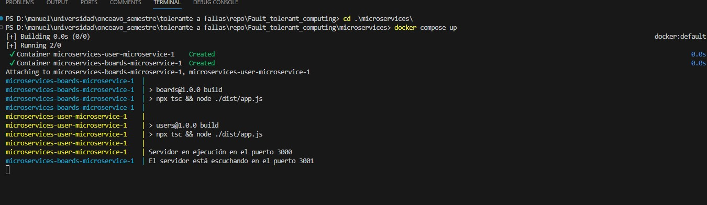
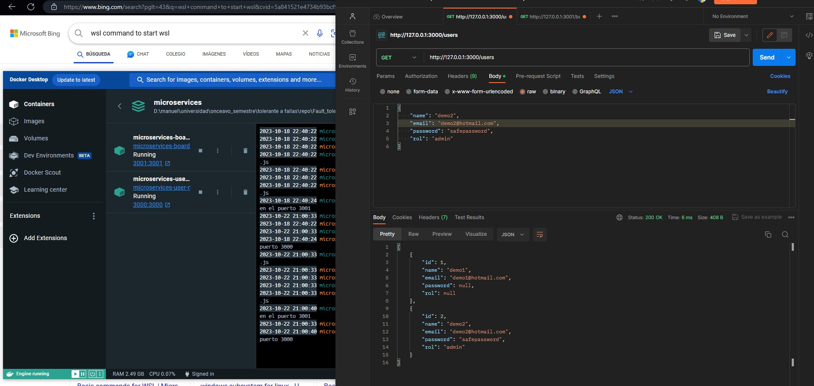
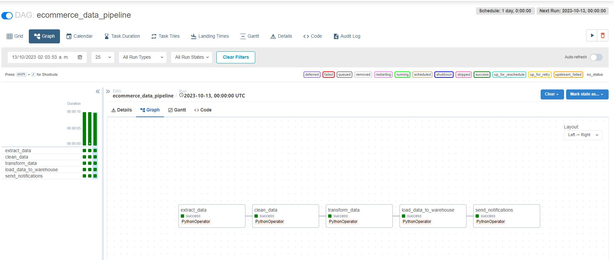

# Introduccion to AirFlow
We saw before how it works Prefect, but lets say that we need to understand the reason of it.
And we cannot talk about Prefect without talking about AirFlow.

In other words AirFlow is other orquestathor of task where we can set up our data flows and work flows
ussing pipelines in certains way, or better said, creating pipelines

In this time I'll not explain how to start the work from zero, bc it's kinda straight forward following the doc.
In my case I chose to run it on Docker

## How to run the code
I already downloaded the yaml file with the configuration for the docker compose, and is there algo the DockFile for the build

The file requiriments.txt was ussed to try run a Machine learning technique for hand writing recognition, but I wasn't able to make it, bc the AirFlow never found out the path even if I pass the absolute path inside the container to the Dataset

So let start.

### First Step
After you already clonated the repo, cd into the airflow folder, then we need to run the next command
```
docker compose up airflow-init
```
and we just have to wait for download of everything


### Second Step
Once the command finished up, now we need to run the command
```
docker compose build
```
This will create the build for our image with out needs

### Thrid Step
Once the previus command finished up, we can run the command: 
```
docker compose up
```
and wait for the container to build up
then we will see something like this on our localhost in the port 8080


### Fouth step
To add a dag, we can just added in dags folder and that will be it, it takes arround 3 min to detect the new dag, you just have to refresh the page until you see it


### That it!!
That was all, now you can start creating you own DAG's you can see it on the web server and all the stuff they give us.


#### Note
If you want to share resulst beteewn task, you will need to look the xcom dock on airflow to be able to use the data from other task and in someway send data