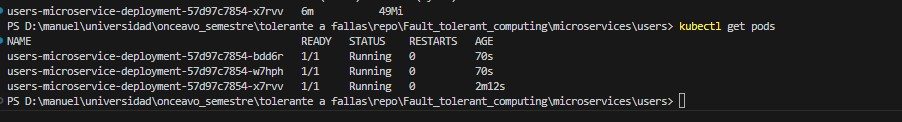

# Introduction to Kubernetes
Once we achive to have multiple "enviroments" in the same computer, for testing/develop/etc, it's time to go on production mode
The plan is to achive this using toll like kubernetes, that offers us the oportinity to have multiple instances of the same image called "Pods", create services for our Pods to comunicate to the external world, and even create "directives/intruccions" of what to do if certain condition happend on resource focus.

So for this assessment we used the previuos microservice that we create for the assesment on docker, and start working on creating our local producction enviroment  (I didn't want to speend some money yet, to host everthing on a cloud service).

## Our App
As mentiond before we are using the same microservices from the previus assessment, but now it has more endpoints and we also created a new microservice for the comments that goes onto the cards in a list.
I craeted the 3 deploys files, with the services for loadBalancing and the Horizotal Pod Autoscaler (HPA), one for each microservice.

### Note
Due the fact that I lack a lot of resources on my machine, I created and took the evidence that the services are working individually bc I I had the 3 of them and tested at same time, those little pods consume almos all the resources hahaha

### How to: Set all for use kubernetes
To been able to use kubernetes, we need to have the tools needed for that, in my case I activated the kubernetes services that are packted down on docker desktop app
I just went  to configuration on the docker app, and there is a section for Kubernetes, just enable and acept and will install evething. But you can go and install any tool that you prefer the most, I saw that exist multiple wrappers for the core functionallity of kubernetes (Are almso the same, just they have their own naming or nomenclature). I will recomment to stick to the normal kubernetes from the docs, the tutorials are really good ones.

Once the instalaction of kubernetes is done, you can just run the command:
```
kubectl //On a terminal/powershell/bash/zh/etc and should display the list of commands and etc.
```
With that we confirm that we have kubernetes already working, if something else happend (go and look for a tutorial on youtube, there is a lot good ones)

#### Docker images and docker hub
With kubernetes already working, we need to create our images and ist's convenient to push it on Docker hub
That's because kubernetes need to get the image from where the pods will be build, and is the image do not exist on the machine, I need to look for it, that the reason, why I recomend to build your images, and pushed into the Docker Hub (Give a good name), on my case you can find out the my imagenes used looking for my userName: *jomadotio*, here is also a image for reference


### Kubernetes
I will be cool to explain how to create a pods from comand, and all the commands that we need, but of course you will not read this hahaa I kown you, been said that
I'll explain hot to make a file with all the needed configuration that way we only need to run a command and all will be deployed to test it out.

#### Creating our pods

First thing, to achive this it's needed to crate the configuration file, in a specific format and extension, this is made ussing a "Yamel file" (.yml)
in this kind of file we set all the values, following the doc realted to the sintax and special key words

```yaml
# user_deployment.yml
apiVersion: apps/v1 #comes from the docs
kind: Deployment # Declare the type in this case a deploy
metadata:
  name: boards-microservice-deployment # The name of the deploy
  labels: 
    app: boardsService # This label is importan, all out services and hpa to find the resources
spec:
  replicas: 1 # Amount of replicas
  selector:
    matchLabels:
      app: boardsService # A way to select the replicas
  template:
    metadata:
      labels:
        app: boardsService # the label should assing to the pod
    spec:
      containers:
      - name: user-microservice # The actual name of the pod
        image: jomadotio/board_microservice:v1 # the image from the pod will built
        ports:
        - containerPort: 3001 # The port for our service
        resources: # here we define the resources we want to give and limit
          requests: 
            memory: "50Mi" 
            cpu: "200m"
          limits:
            memory: "200Mi"
            cpu: "1000m"
```

As you can see, looks pretty simple, once you understand the structure
Once we have it, we can make our first deploy by running the next command:
```
kubectl apply -f the_file_name.yml //in this case user_deployment.yml
```
This command will make a deploy and create the pods, and you will see somthing line this:

but will be only one 

### How I test it? - Creating a service
If you try and test the pod, just created will face this couple of questions:
 - To where should I send the reques?
 - That it?, I do not have to do something related to the internal network or something like that?
 - Duckkk, how I test it?
Don't worry I come across with those questions too, and let me explaint realquick what append.

Once we have our pod, we only created a mini-computer running our app, in a internal networking on your computer, but we never set some configuration to know expose the port, how to send the request, etc.
For that the seriveces on kubernetes play a huge rool, bc ussing it, we can create the logical connection to the app, and see the results
There excist a couple of services, but for our case, I will explain the loadBalancer (bc is the only one I needded)

```yaml
apiVersion: v1 # From docs
kind: Service # Type
metadata:
  name: users-service # Name of the serivice
spec:
  selector:
    app: usersService # The tag for all the resources, should target
  ports:
  - protocol: TCP # protocol
    port: 3000 # external port
    targetPort: 3000 # Internal port (pod port)
  type: LoadBalancer # redirect the request to perform the best
```
As you can the service is to simple too, an straigth forward, with now you will able to test the api ussing the localhost and the port assgined and will see the response

### WE NEED MORE, A LOT OF USER! - Creating a HPA
We have our service working, but let simulate a real world eviroment, what will happend if a loot of users make a request, the times will be so long, and the health of the service will be poor, to avoid that, we need to create a rule, that says if some condition happend, do this.

For that, is the Horizontal Pod Autoscaler (HPA), this is a set of instruccion where we can define, the condition, and once it meets, in our case, do another deploy that way we can have multiple pods, without been stick on the cluster, wating to run other command to enable a new pod manually.

```yaml
apiVersion: autoscaling/v2 # From the docs
kind: HorizontalPodAutoscaler # Define that is a HPA
metadata:
  name: user-autoscaler # The name assigned to the HPA
spec:
  scaleTargetRef:
    apiVersion: apps/v1 # What is targetting
    kind: Deployment # Type of the target
    name: users-microservice-deployment # And the name of the target
  minReplicas: 1 # Min of replicas (pods)
  maxReplicas: 4 # Max of replicas
  metrics: # The metric ussed to do a deployment
  - type: Resource # Looking into the resources
    resource:
      name: cpu # Looking into the CPU
      target:
        type: Utilization
        averageUtilization: 1 # For demo pourpuse, also the api is lightwwight, if a pod get to 1% of ussage for the cpu assigned, it created a new deploy
```
As you can see, same history, we need to paly arround with the commands, and at the end, will get our file, that explain all.
In my case for demo pourposes, I selected the 1% of the computational power and create a new pod, just to thest the funtionallity itself

But to make the HPA to create a new deploy, we need to do a kind a test to start consuming CPU, for that we make a load test ussing postmant, making a lot of request into the endpoints, just to stress it, and start creating the new deploys


Meanwhile the test is running, you can see the pods geting created and working fine


You can se that 2 pods, where created once we achive the threshhold

And that it, now you have our oun production env, that will auto scalate as it needs, ready for the real world.

## Evidences
### User Microservice


### Boards Microservice


### Comments microservice

